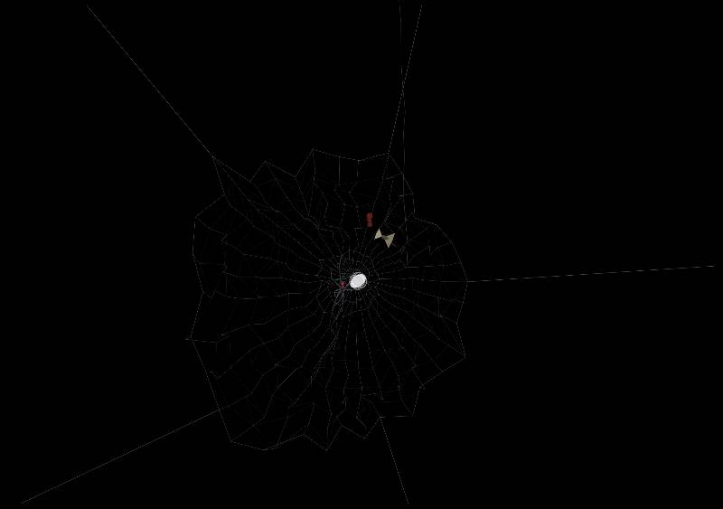

# Spiderweb — generative algorithm × verlet physics

*[繁體中文版 README](./README.zh-TW.md)*



A single-file, dependency-light spider web you can **grab and pull**. It marries two
classic web demos:

- the **web-generation algorithm** of Greg Kepler's *spider-webs-js* (organic radial
  anchors → suspension frame → rays → bars with random gaps, Y-strands and reinforcement), and
- the **physics engine, mouse-dragging and walking spider** of Sub Protocol's *verlet-js*.

The original generator was locked to Processing.js + toxiclibs and was not interactive.
Here the generation logic is re-implemented from scratch on verlet-js `Particle` +
`DistanceConstraint`, so the whole web is a real verlet cloth: it sags under gravity,
springs back, and can be dragged — and a spider crawls across it.

The silk thicknesses, the central **strengthening spiral**, and the sticky-free
**free zone** are tuned to match how real orb-weaver webs are actually built (see
[Biological accuracy](#biological-accuracy)).

---

## Features

- 🕸 **Procedural web** — every web is unique: randomized anchor count/radius, ray density,
  organic gaps, Y-shaped strands and reinforcement threads.
- 🧲 **Real verlet physics** — drag any thread or the spider with the mouse; the web
  deforms and recovers.
- 🕷 **Black-widow spider** — descends head-down on a silk dragline, walks the web on a
  ≥4-feet gait, and can be torn off the web if you drag it far.
- 🐛 **Live hunting simulation** — spawn insects (fly / moth / mosquito / roach) that fly in and
  stick anywhere on the web; the spider hunts them: approach → bite & wrap into a cocoon →
  carry to the hub → feed → the drained husk drops away. With realistic prey-priority logic.
- 🔬 **Biologically informed** — silk thickness hierarchy, hub strengthening spiral and a
  central free zone modeled on real orb webs.
- 📦 **Self-contained** — one `index.html` + one vendored `verlet-1.0.0.js` (53 KB). No build
  step, no CDN, no network.

## Run it

The page must be served over HTTP (not opened as a `file://` URL).

```bash
cd spiderweb-integrated
python3 -m http.server 8000
# then open http://localhost:8000/
```

Keep the tab in the foreground — the animation is driven by `requestAnimationFrame`, which
browsers throttle in background tabs.

## Controls

| Action | Effect |
| --- | --- |
| **🐛 放昆蟲** button | spawn a random insect that flies onto the web |
| **Drag a thread / the spider** | pull it around; drag the spider far to tear it off the web (it crawls back) |
| **Drag an insect** | pluck a stuck insect off the web (it falls away) |
| **R** key / **重新結網** button | regenerate a brand-new random web |
| **蜘蛛開關** button | toggle the spider on/off |
| resize window | the web rebuilds to fit |

## How it works

`VerletJS.prototype.organicWeb(origin, opts)` builds the web in six stages, porting
Greg Kepler's structural logic onto verlet primitives:

1. **Anchors** — `pointNum` radial directions, each with a *randomized* radius, so the
   outline is an irregular polygon rather than a circle.
2. **Rays** — `raysPerSegment` rays are interpolated along each anchor→anchor arc; each ray
   is a chain of particles running from an outer perimeter point inward to a shared hub.
3. **Hub** — all rays meet at a central hub particle.
4. **Frame** — adjacent outer points are linked into the perimeter ring.
5. **Suspension** — the anchor rays shoot a thread out to the canvas edge and **pin** it
   there; these reinforced lines hold the whole web up.
6. **Capture spiral** — bars link adjacent rays at each radial level, with random gaps,
   Y-strands and extra reinforcement — leaving a sticky-free **free zone** around the hub,
   which is itself wrapped in a 3-turn **strengthening spiral**.

The spider builder and `crawl()` routine are adapted from the verlet-js spiderweb example
(only the draw colors and a `scale` factor were changed). Mouse dragging is built into the
verlet-js core (`nearestEntity()` + the drag step in `frame()`).

## Biological accuracy

Real orb webs use different silks for different jobs, and they differ a lot in thickness.
The render follows that hierarchy (thick → thin):

| Part | Real silk | Role | Relative width |
| --- | --- | --- | --- |
| Anchor / bridge | major-ampullate dragline, often reinforced/bundled | bears the whole web's load | **thickest** |
| Frame (perimeter) | dragline, often doubled (primary + secondary frame) | structural support | thick |
| Hub / strengthening spiral | dense non-sticky turns around the centre | reinforces the hub the spider rests on | medium-thick |
| Radii (spokes) | single dragline, ~3 orders of magnitude stiffer than capture silk | absorb most prey kinetic energy | medium |
| Capture spiral | flagelliform core, only **1–5 µm**, stretches up to 300%, beaded with glue | catches prey | **thinnest** |

Two structural details modeled from the literature:

- **Free zone** — a sticky-thread-free ring around the hub where only radii run and the
  spider sits.
- **Strengthening spiral** — several tight non-sticky turns reinforcing the hub (so the
  centre is denser, not every ring).

## Hunting simulation

Insects are lightweight objects (not verlet particles) that fly in from a screen edge to a
random **depth** on the web and stick to the nearest thread, struggling (which shakes the
web) with a decaying amplitude. The spider runs a small state machine:

```
descend → toCenter → waiting → approaching → wrapping → carrying → feeding → (drop) → waiting
```

Cocoon wrap time scales with prey size (**4–8 s**); feeding is a timed hold (no shrink).
Prey priority is modelled on real behaviour:

- always drawn to the **newest** stuck insect;
- interrupting a wrap **keeps that prey's partial progress** (it's finished later);
- **carrying a cocoon to the hub is non-interruptible**;
- **feeding is interruptible** — the spider drops the cocoon to hunt fresh prey, then comes
  back to finish feeding (catching always outranks feeding).

## Status & roadmap

**Done**

- Procedural web generator on verlet-js, biologically-tuned silk hierarchy, free zone,
  strengthening spiral, pure-black presentation.
- Black-widow spider: head-down dragline descent → return to hub → wait.
- Full prey lifecycle (arrive → stick → struggle → approach → wrap → carry → feed → drop).
- Multi-prey priority/interruption logic (newest-first, retained partial wrap,
  non-interruptible carry, resumable feeding).
- Mouse interaction: drag threads/spider, pluck insects, tear the spider off the web with
  graceful crawl-back recovery.
- Stable ≥4-feet gait; softer grips so crawling yanks the web less.

**Future optimization directions**

- **True alternating tetrapod gait** — a visible 4-up / 4-down swing cycle for more lifelike
  walking (current gait guarantees ≥4 feet down but doesn't animate the swing phase).
- **Visible silk-spinning** while wrapping — strands drawn from the spinnerets around the prey.
- **Less carry-time web distortion** — further tuning of grip stiffness / body coupling.
- **Web damage & repair** — heavy prey tears threads; the spider re-spins them.
- **Performance** — spatial hashing for `nearestWebParticle`/`nearestWebTo` (currently linear
  scans of ~500 particles per query) to scale to bigger/denser webs and more insects.
- **Prey variety** — escaping/struggling-free prey, species-specific speed & size, and a
  small on-screen controls panel (sliders for density, gravity, spawn rate, etc.).
- **Touch / mobile support** and an optional dew-droplet / glow aesthetic.

## Project structure

```
spiderweb-integrated/
├── index.html          # the whole app: organicWeb generator + spider + render loop
├── verlet-1.0.0.js     # vendored verlet-js engine (Sub Protocol, MIT)
├── README.md           # this file (English)
├── README.zh-TW.md     # 繁體中文說明
├── LICENSE             # MIT (this project)
└── NOTICE.md           # third-party attributions
```

## Credits & references

**Origin projects**

- **Greg Kepler — spider-webs-js** — the web-generation *algorithm* this project re-implements.
  https://github.com/gregkepler/spider-webs-js
  *(No code was copied; the original carries no license, so only the algorithmic concept was
  reused — see [NOTICE.md](./NOTICE.md).)*
- **Sub Protocol — verlet-js** — the physics engine (vendored), draggable interaction, and
  the spider/crawl routine. MIT licensed.
  https://github.com/subprotocol/verlet-js

**Spider-web biology**

- The elaborate structure of spider silk — *PMC* — https://pmc.ncbi.nlm.nih.gov/articles/PMC2658765/
- Spider orb webs rely on radial threads to absorb prey kinetic energy — *PMC* — https://pmc.ncbi.nlm.nih.gov/articles/PMC3385755/
- The secondary frame in spider orb webs — *Scientific Reports* — https://www.nature.com/articles/srep31265
- The engineering logic behind spider web geometry — *Aptive* — https://aptivepestcontrol.com/pests/spiders/the-engineering-logic-behind-spider-web-geometry/

## License

[MIT](./LICENSE) © 2026 djchrisssssss. Third-party components retain their own licenses
([NOTICE.md](./NOTICE.md)).
